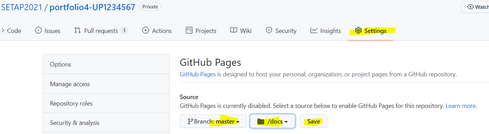
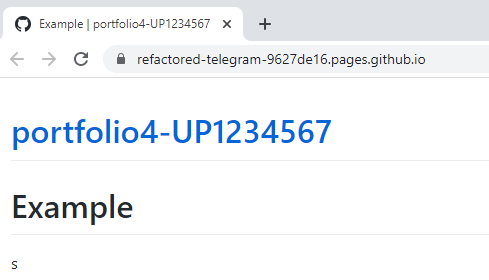
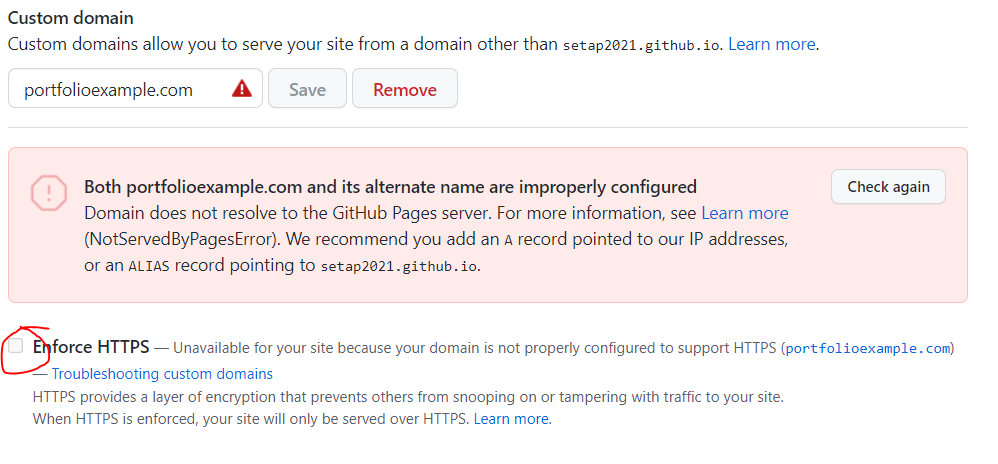
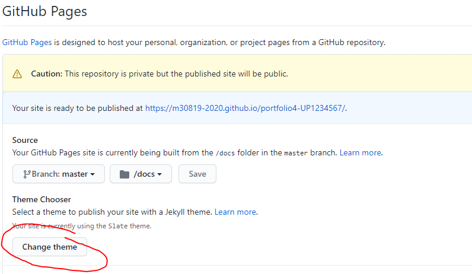

# **School of Computing**

> Experimental badges (Do not rely on these)


| Module Code            | M30819                                                                                                   |
| ---------------------- | -------------------------------------------------------------------------------------------------------- |
| Module Title           | Software Engineering Theory and Practice                                                                 |
| Module Coordinator     | Steven Ossont <[steven.ossont@port.ac](mailto:steven.ossont@port.ac)>                                    |
| Assessment Item Number | Item 1 - Set exercise (coursework) (CW)                                                                 |
| Assessment Title       | Coursework   CW[1:5] / Portfolio P[1:12]                                                                 |
| Moodle                 | [https://moodle.port.ac.uk/course/view.php?id=15815](https://moodle.port.ac.uk/course/view.php?id=15815) |
<!-- TODO assessment number -->

## Schedule and Deliverables

| Deliverable | Value     | Format           | Outcomes | Deadline           | Late/ECF Deadline |
| ----------- | --------- | ---------------- | -------- | ------------------ | ----------------- |
| P4         | 1% |PDF & Repo | Pass/Fail       | 03 Dec 2021, 23:00 | Do 10 of 12 P[1:12]     |
<!-- TODO check +10 days alter in auto checker-->

## Coursework Assessment **(50% of Module)**
<!-- markdown-line-length-disable -->
<!-- markdownlint-disable MD013 -->

| Name                                                                                              | Deadline                                                                               | Submission                     | % of CW | Feedback(Est.) |
| ------------------------------------------------------------------------------------------------- | -------------------------------------------------------------------------------------- | ------------------------------ | ------- | -------------- |
| [CW1](https://github.com/SETAP2021/SETAP/blob/main/Coursework/GroupAssessment.md)                 | 05 Nov                                                                                 | Project plan & Proposal   | 5%      | 19 Nov         |
| [CW2](https://github.com/SETAP2021/SETAP/blob/main/Coursework/GroupAssessment.md)                 | 10 Dec                                                                                 | Requirements Specification     | 20%     | 10 Jan         |
| [CW3](https://github.com/SETAP2021/SETAP/blob/main/Coursework/GroupAssessment.md)                 | 25 Feb                                                                                 | Design Documentation           | 20%     | 25 Mar         |
| [CW4](https://github.com/SETAP2021/SETAP/blob/main/Coursework/GroupAssessment.md)                 | 22 Apr                                                                                 | Prototype (demo + code)        | 30%     | 06 May         |
| [CW5](https://github.com/SETAP2021/SETAP/blob/main/Coursework/GroupAssessment.md)                 | 13 May                                                                                 | Project Report                 | 5%      | 06 Jun         |
| [Portfolio[1:12]](https://github.com/SETAP2021/SETAP/blob/main/Coursework/IndividualPortfolio.md) | [List](https://github.com/SETAP2021/SETAP/blob/main/Coursework/IndividualPortfolio.md) | 10 x Portfolio items @ 2% each | 20%     | + 2 weeks      |
| Total                                                                                             |                                                                                        |                                | 100%    |                |

<!-- todo - highlight correct section | -->
<!-- markdownlint-enable MD013 -->
# Notes and Advice

<!-- markdown-link-check-disable -->

* The [Extenuating Circumstances procedure](https://upsu.net/advice/academic-advice/extenuating-circumstances) is there to support you if you have had any circumstances (problems) that have been serious or significant enough to prevent you from attending, completing or submitting an assessment on time. If you complete an Extenuating Circumstances Form (ECF) for this assessment, it is important that you use the correct module code, item number and deadline (not the late deadline) given above.

* [ASDAC](http://www2.port.ac.uk/additional-support-and-disability-advice-centre/)
  are available to any students who disclose a disability or require additional support for their academic studies with a good set of resources on the [ASDAC
  Moodle site](https://moodle.port.ac.uk/course/view.php?id=3012)

* The University takes any form of academic misconduct (such as plagiarism or cheating) seriously, so please make sure your work is your own. Please ensure you adhere to our [Code of Student Behaviour](https://policies.docstore.port.ac.uk/policy-053.pdf) and watch the video on [Plagiarism](https://www.youtube.com/watch?v=2a0QJnCmfEs).

* Any material included in your coursework should be [TECFAC 08 Plagiarism](https://www.youtube.com/watch?v=2a0QJnCmfEs) fully cited and referenced in **APA 7** format.  Detailed advice on referencing is available from the [library](https://library.port.ac.uk/w165.html).

* Any material submitted that does not meet format or submission guidelines, or falls outside of the submission deadline could be subject to a cap on your overall result or disqualification entirely.

* If you need additional assistance, you can ask your personal tutor, student engagement officer [ana.baker@port.ac.uk](mailto:ana.baker@port.ac.uk), academic tutor [xia.han@port.ac.uk](mailto:xia.han@port.ac.uk) or your lecturers.

* If you are concerned about your mental well-being, please contact our [Well-being service](https://myport.port.ac.uk/guidance-and-support/health-and-wellbeing).

## Assessment rules

* CW[1:5] [https://github.com/SETAP2021/SETAP/blob/main/Coursework/GroupAssessment.md](https://github.com/SETAP2021/SETAP/blob/main/Coursework/GroupAssessment.md)
* P[1:12] [https://github.com/SETAP2021/SETAP/blob/main/Coursework/IndividualPortfolio.md](https://github.com/SETAP2021/SETAP/blob/main/Coursework/IndividualPortfolio.md)

<!-- markdown-link-check-enable-->

 > Check every assessment as these may be updated

## Objective

* To understand Markdown better (tables, images)
* To understand how the pandoc PDF builder works
* Gain skills for the CW[1-5] assessments
* To use and understand Github Pages

> HINT:  Your CW project will probably need a website, this may help address your needs

## Submission process

This GitHub repository is your private repository and this is where all parts of
the Portfolio submission **must** get committed. You should be familiar with Git and
GitHub.

In this Portfolio you will clone this repository, add/change/delete the existing Markdown (`*.md`)
files and commit changes back to this GitHub repository.

You should commit frequently and push changes to this github repository often
(At least once per day that you work on this Portfolio).

This repository will automatically be copied for marking at the deadline.

There are multiple parts to this Portfolio, all parts must be completed.

If you include a figure/image/diagram, it must be committed to **this** repository.
(Preferably in the `images` folder). Only images that are visible in the Markdown
files will be marked. This means that you must add the image to your Markdown
file.

If you use an external program to generate images (e.g. Paint, Visio, PowerPoint) you
may wish to store the images in the source format in this repository as well.

> The resulting PDF is re-generated and marked. Always check the PDF

## Recommended workflow

1. Download (`clone/pull`) files this GitHub repository.

2. Edit the Markdown files in a text editor.

3. Save (`git commit`) your files to your git repository (frequently)

4. Push (`git push`) your commits to GitHub as often as you want.
(Only the files saved in the GitHub repository will be marked)

5. When you think you are done, [double check](#when-you-are-ready-to-submit).

> There are no situations where you should be editing/uploading/downloading files using the Github.com webpage (this includes the download as zip option)

## P4.1 Student ID

1. Create a file with the filename `Student.id`, add **your** Student ID to the content of this file. Note:

    * Invalid ID = No marks
    * The file extension is `.id` other file extensions e.g. `.txt` are not permitted
    * The content of the file should be your ID ONLY, e.g. `UP1234567`
    * You may have a return character at the end of the line `\n` (Note this is not two ASCII text characters)
    * You need the `UP` (case sensitive)
    * Filename is case sensitive
    * File contents are case sensitive
    * File should contain one line of text only
    * Markdown formatting is NOT permitted e.g. `*` or `-`
    * The file `Student.id` must be on the root of you repo (Not in a folder)

2. Remove the `README.md` import statement from your `.pandoc.yml` file. This is here to generate a PDF of instructions, but should be removed and not included as part of your submission.

3. Import your `Student.id` as the **last** import in your `.pandoc.yml`. This will add your Student ID to your PDF submission.

4. Check the following commands returns your github username:

   ```shell
   $ git config --global user.name
   ```

5. Check the following commands returns the privacy email that you are given by GitHub:

   ```shell
   $ git config --global user.email
   ```

   > This will **not** be your uni email (You do not want to make *that* public)

6. Ensure you know *how* to use `nano`; this is a requirement [https://www.howtogeek.com/howto/42980/the-beginners-guide-to-nano-the-linux-command-line-text-editor/](https://www.howtogeek.com/howto/42980/the-beginners-guide-to-nano-the-linux-command-line-text-editor/)

<!-- Save, Commit -->

### Validate this section:

[[Checklist, Add, Commit, Push, Check feedback workflow, alter if needed, repeat]](https://github.com/SETAP2021/SETAP/blob/main/Coursework/IndividualPortfolio.md#rules)

<!-- Save, Commit -->

## P4.2 Enable GitHub pages

You can use GitHub Pages to host a website directly from a GitHub repository.

[https://docs.github.com/articles/configuring-a-publishing-source-for-github-pages/](https://docs.github.com/articles/configuring-a-publishing-source-for-github-pages/)

1. You must enable GitHub Pages on **this** repo for it to work.

   * Go to GitHub.com for *this* repo `->` Settings tab (usually not visible) `->` Pages (Last tab on left)

   

   * Enable GitHub pages

     * You must set the `GitHub Pages visibility` to **PUBLIC**  (Default is private)
     * You must use the default branch e.g.  `main` /  `master`
     * You must use the `docs` folder
     * You have elevated permissions on this repo to enable this, please be careful

   * When enabled, you will get a website URL (e.g. `https://refactored-telegram-9627de16.pages.github.io/`).


2. Add content to your new website

   * Create a markdown file `docs/README.md` and add the content

     ```markdown
     # Portfolio 4

     Hello World.
     ```

   * Check your website to see your new content (e.g. Reload the URL you were given)
   * You should see your new website -- (fastest website setup ever?)

3. Take an image of your website and save as `images/ghpages.png`

     * It must show the URL and corect content, for example:

      

4. Add the `ghpages.png` image to your Portfolio PDF

<!-- Save, Commit -->

### Validate this section:

[[Checklist, Add, Commit, Push, Check feedback workflow, alter if needed, repeat]](https://github.com/SETAP2021/SETAP/blob/main/Coursework/IndividualPortfolio.md#rules)

<!-- Save, Commit -->

## P4.3 Use a custom domain name

You should have applied for the Student Developer Pack (**if not please do it now**): [https://education.github.com/pack](https://education.github.com/pack)

The Student Developer Pack offers benefits that you might want to look into; one is a free domain.
You will need a domain for this part of the Portfolio (**be aware this can take time** e.g. ~ 24hrs)

Domain:

* You can use any TLD you want (e.g. one you already own)
* Apply for one now and when Portfolio4 is completed, feel free to use the domain personally
* You may want to consider a domain that you can use for the CW

1. Register a TLD (Pick one):

    * Use your own
    * Name.com (via [https://education.github.com/pack/](https://education.github.com/pack/)) - 1 free year domain registration, 1 free year Advanced Security (SSL, privacy protection, and more).
    * namecheap (via [https://education.github.com/pack/](https://education.github.com/pack/)) - 1 year domain name registration on the .me TLD.
    Name.com will give a free domain to GitHub students. If you want you can sign up for a free domain and use your new domain in this exercise.

2. Go to your GitHub `pages` settings and add your TLD. Resolve any errors and check your GitHub pages are served on your new TLD. You will need to follow the GitHub instructions to complete this task.

     * The GitHub settings will give you warnings if your DNS is not configures properly. For example:

      

3. Enable `Enforce HTTPS`

4. Create a new file called `GitHubPages.url` on the root of your repo.
    Add the URL that will display your GitHub pages as text to this file.

      * File name is case sensitive and must be on the repo root
      * Content must be a single line containing a full URL to your pages site.
      * No comments, new lines, or markdown
      * The content on this URL will be marked (`curl` will be used to get your site using this URL file)

5. Ensure you add this new file to your repo (and push)

6. Build and check your PDF

<!-- Save, Commit -->

### Validate this section:

[[Checklist, Add, Commit, Push, Check feedback workflow, alter if needed, repeat]](https://github.com/SETAP2021/SETAP/blob/main/Coursework/IndividualPortfolio.md#rules)

<!-- Save, Commit -->

## P4.4 Pick a website theme

1. Change your GitHub repo theme (to any you like)

    

    * Check your website URL to see your new theme (e.g. This is the URL in your `GitHubPages.url`)
    * Make sure your page theme is set up properly
      * Check you new theme is visible
    * You may need `ctrl` + `F5` to refresh; or alternative browser; or clear cache

2. Take a screenshot of your new theme and save it as `images/theme.png`

3. Add this new image to your PDF

    > Your website settings are stored in this file `docs/_config.yml`, have a look at the contents

    * `markdown: GFM` means that you are using `GitHub Flavoured Markdown` [https://github.github.com/gfm/](https://github.github.com/gfm/)

    > GitHub pages supports two different markdown flavours [`GitHub Flavoured Markdown (GFM)`](https://github.github.com/gfm/) and [`Kramdown`](https://kramdown.gettalong.org/documentation.html).

4. Build and check your PDF

5. Read and understand what GitHub pages are and what they can do:

    Official : [https://pages.github.com/](https://pages.github.com/)

    Guide: [https://docs.github.com/en/free-pro-team@latest/github/working-with-github-pages](https://docs.github.com/en/free-pro-team@latest/github/working-with-github-pages)

    GitHub Pages runs Jekyll on your Markdown file to produce static HTML pages. These appear as your website.

    Developing a website this way can be slow when wanting to visualize changes.

    You can run Jekyll locally on your machine, this will allow you to make changes to markdown pages and immediately see the change in your browser locally.

    If you want to run Jekyll locally read the following resources:

    Window sub system: [https://www.vgemba.net/blog/Setup-Jekyll-WSL/](https://www.vgemba.net/blog/Setup-Jekyll-WSL/)

    Plenty of config options: [https://jekyllrb.com/docs/configuration/options/](https://jekyllrb.com/docs/configuration/options/)

#### Markdown tip

If you include code / scripts in Markdown please tag them with the appropriate type so the syntax highlights properly

[http://www.rubycoloredglasses.com/2013/04/languages-supported-by-github-flavored-markdown/](http://www.rubycoloredglasses.com/2013/04/languages-supported-by-github-flavored-markdown/)

<!-- Save, Commit -->

### Validate this section:

[[Checklist, Add, Commit, Push, Check feedback workflow, alter if needed, repeat]](https://github.com/SETAP2021/SETAP/blob/main/Coursework/IndividualPortfolio.md#rules)

<!-- Save, Commit -->

## P4.5 Markdown table

Markdown does not support all the features we may need for tables, but there are a couple of tips you may need to alter the resulting PDF
(Note on the GitHub rendered pages you may not see a difference; check the PDF)

1. To add table captions add a `:` before the caption (table captions go **above** the table)

    For example:

    ```markdown
    :This will be the table caption in the PDF only

    | Syntax      | Description | Test Text     |
    | :---        |    :----:   |          ---: |
    | Header      | Title       | Here's this   |
    | Paragraph   | Text        | And more      |
    ```

    :This will be the table caption in the PDF only

    | Syntax      | Description | Test Text     |
    | :---        |    :----:   |          ---: |
    | Header      | Title       | Here's this   |
    | Paragraph   | Text        | And more      |

2. You can control the column width by altering the number of `-` on line two of a table.

     * The number of `-` symbols on line two of a table indicates the width of the column; more `-` the wider the column
     * To split a table 25% / 75% on two columns use:  `|-|---|`
     * If you are using a markdown auto formatter/ extension it may not respect widths; manual editing is required

      For example:

      ```markdown
      | Narrow 10%      | Huge 70% | Narrow  20%  |
      | - | ------- | -- |
      | 1   | We can add a very long bit of text to expand this column       | Note 1          |
      | 2   | Text        | Example 2       |
      ```

      | Narrow 10%      | Huge 70% | Narrow  20%  |
      | - | ------- | -- |
      | 1      | We can add a very long bit of text to expand this column         | Note 1         |
      | 2   | Text           | Example 2      |

3. You can align text in the columns to the left, right, or center by adding a colon (:) to the left, right, or on both side of the hyphens within the header row. For example

    ```markdown
    | Left        | Ctr         | Right         |
    | :---        |    :----:   |          ---: |
    | Header      | Title       | Here's this   |
    | Paragraph   | Text        | And more      |
    ```

    | Left      | Ctr | Right    |
    | :---        |    :----:   |          ---: |
    | Header      | Title       | Here's this   |
    | Paragraph   | Text        | And more      |

4. Below is the markdown for a table. Add this markdown to your `Portfolio.md` and build the PDF. The table does not look very good and does not make use of the space very well.
Save an image of the table as it appears in the PDF. Name the file `images/before.png`

    ```markdown
    | Number | Table with a long line of text  |
    |-| -|
    | 1 | *The quick brown fox jumps over the lazy dog* is an English-language pangram -- a sentence that contains all of the letters of the English alphabet. Owing to its brevity and coherence, it has become widely known. The phrase is commonly used for touch-typing practice, testing typewriters and computer keyboards, displaying examples of fonts, and other applications involving text where the use of all letters in the alphabet is desired.|
    | 2 |This will look good in GFM and fine in your PDF|
    ```

5. Modify the table by:

   * adding the following **caption** to the table `The quick brown fox jumps over the lazy dog`
   * aligning the text in column 1 to the *right*
   * distributing the columns so that column one has 10% and column two has 90% of the table width
   * Rebuild your PDF
   * Save an image of the table as it appears in the PDF. Name the file `images/after.png`. It must show the above modifications.

6. Add both the before and after images to your `Portfolio.md` and ensure they are visible in the PDF

<!-- Save, Commit -->

### Validate this section:

[[Checklist, Add, Commit, Push, Check feedback workflow, alter if needed, repeat]](https://github.com/SETAP2021/SETAP/blob/main/Coursework/IndividualPortfolio.md#rules)

<!-- Save, Commit -->

## P4.6 Resize an image

* GFM does not support image resize
* You probably don't need to resize images on GitHub Pages as the generated HTML looks fine
* You probably need resize images in your PDF

One method is to add a width parameter to the image markdown e.g.

`{width=50px}`

Here are 3 images with different sizes; note on github.com the sizes will be the same, in the PDF they will be different

{width=30px}

{width=60px}

{width=90px}

This will cause `{width=??px}` to appear on your GFM rendered pages, but will be used in the PDF to resize the images (You will need this for the CW).

1. Add a second import of the `after.png` image to your `Portfolio.md` file, but set the width to `50px`. Check the PDF

<!-- Save, Commit -->

### Validate this section:

[[Checklist, Add, Commit, Push, Check feedback workflow, alter if needed, repeat]](https://github.com/SETAP2021/SETAP/blob/main/Coursework/IndividualPortfolio.md#rules)

<!-- Save, Commit -->

## When you are ready to submit

If you think you are complete, ***STOP*** and double check.

* As part of this portfolio you probably generated images/diagrams/figures.

  * These files should be committed to GitHub.
  * They **must** be linked into a Markdown file for the relevant task.

* You may have forgotten to push your commits (You committed locally but did not
  push to GitHub). **Only the content in GitHub will be marked**.

* You should pass the GitHub `PortfolioAdvisor` workflow

* You should pass the GitHub `MarkdownChecker` workflow

* You should pass the GitHub `Pandoc` workflow

### Your resulting PDF is auto re-generated and marked after the deadline

### **Your repository will be copied for marking automatically at the coursework deadline.**
